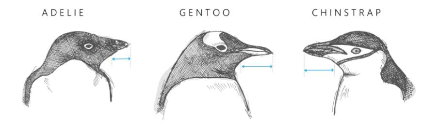
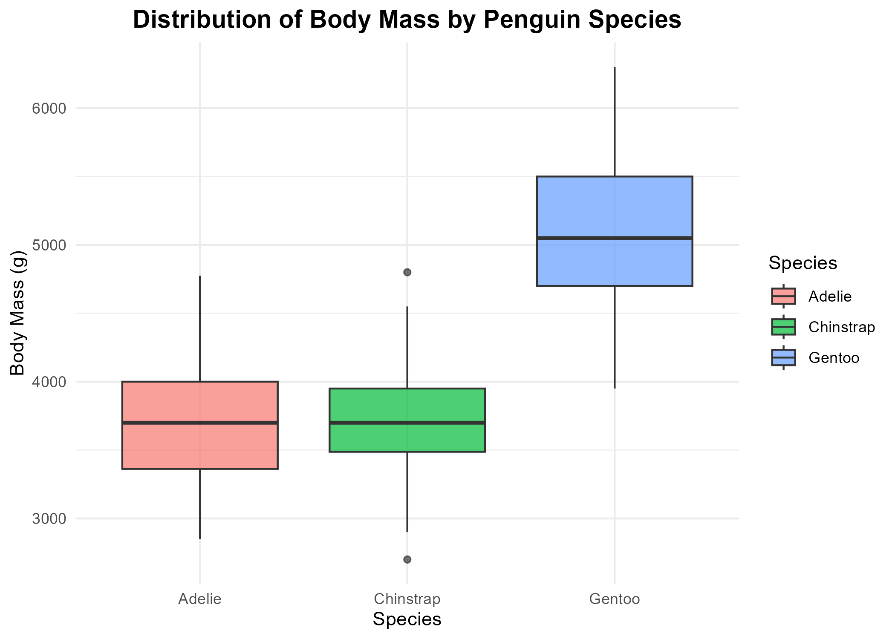
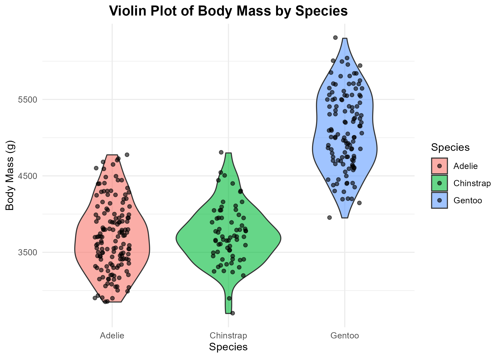
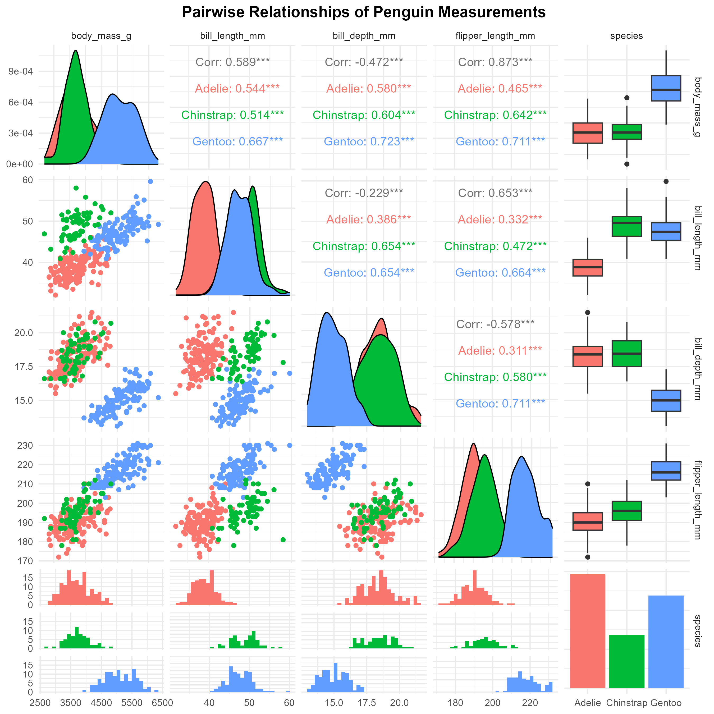
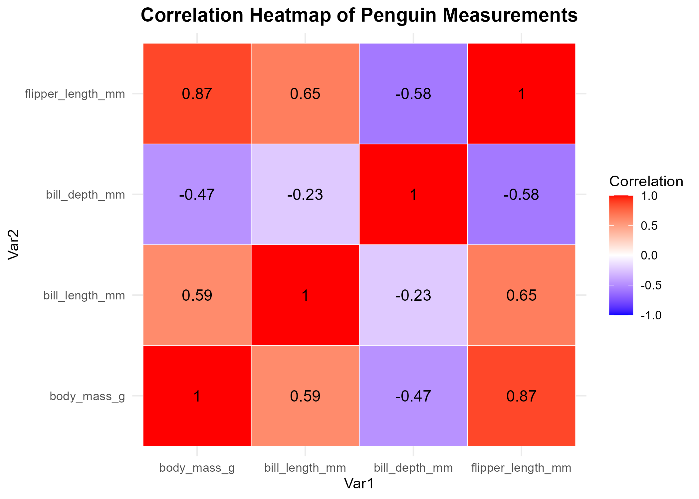

# Penguin Classification & Statistical Analysis  
*A modern alternative to the classic iris dataset*

We all know the famous **Iris dataset** — 150 flowers, 4 measurements, 3 species.  
It has been the default example for decades in statistics and machine learning.

But now we have something better:

## The Palmer Penguins Dataset  
This dataset is a more realistic, modern, and interesting alternative to iris.  
It contains measurements for three penguin species:

- Adelie  
- Gentoo  
- Chinstrap  

    

<table>
  <tr>
    <td>
      
    </td>
    <td>
      <p>With variables such as:</p>
      <ul>
        <li>bill length</li>
        <li>bill depth</li>
        <li>flipper length</li>
        <li>body mass</li>
        <li>island</li>
        <li>sex</li>
      </ul>
    </td>
  </tr>
</table>


It is built into R via the **palmerpenguins** package.

---
# Project Goals

1. **Explore the dataset through plots and summaries**  
   - Scatterplots, boxplots, violin plots, pairwise plots, and correlation heatmaps.

2. **Perform statistical tests**  
   - ANOVA for body mass and flipper length.  
   - Tukey’s HSD post-hoc tests.  
   - Correlation analysis between numeric variables.

3. **Distinguish penguin species based on measurements**  
   - Visual separation via PCA.  
   - Linear Discriminant Analysis (LDA) to maximize species separation.

4. **Build predictive models to classify species**  
   - Logistic Regression.  
   - Decision Tree.  
   - LDA as a predictive model.

5. **Compare models and evaluate performance**  
   - Confusion matrices, overall accuracy, and Kappa statistics.  
   - Observations about which species are easiest/hardest to classify.

6. **Provide clear, reproducible visualizations**  
   - Save all plots in a dedicated `plots/` folder.  
   - Include PCA, LDA, and EDA plots with concise captions for interpretation.


---
## Exploratory Data Analysis (EDA)

We explored the Palmer Penguins dataset using various plots to understand measurement distributions and species differences.

### Scatterplot: Body Mass vs Flipper Length
  
Shows the relationship between body mass and flipper length. Gentoo penguins are easily distinguishable by their larger size, while Adelie and Chinstrap overlap more.

### Boxplot: Body Mass by Species
  
Displays the distribution of body mass for each species. Gentoo are heavier on average, Adelie are intermediate, and Chinstrap are lighter.

### Violin Plot: Body Mass by Species
  
Combines distribution shape and individual data points for body mass. Highlights variability within each species.

### Pairwise Relationships
  
Shows scatterplots for all numeric variables with species coloring, helping identify correlations and measurement patterns.

### Correlation Heatmap
  
Illustrates correlations between body mass, flipper length, and bill dimensions. Strong positive correlations are visible between body mass and flipper length.

---

# Files

### `analysis.R`  
Full analysis pipeline including:

- Data cleaning  
- Exploratory Data Analysis (scatterplots, boxplots, violin plots, correlation heatmaps, PCA)  
- Statistical tests (ANOVA, correlations)  
- Logistic Regression  
- Decision Tree model  
- LDA analysis  
- Interpretation + conclusions  

---

### Logistic Regression vs Decision Tree

- Logistic regression achieved **~91% accuracy overall**, performing perfectly for Gentoo, very well for Adelie, and moderately for Chinstrap.  
- Decision tree provided a **visual, rule-based model**, slightly lower accuracy (~88–90%) on overlapping species.  
- Both models highlight that **body mass and flipper length** are the most important predictors.  
- Gentoo is the easiest species to classify, while Chinstrap is the hardest.  

---

### Linear Discriminant Analysis (LDA)

LDA achieved **~97% accuracy**, outperforming logistic regression and the decision tree:

| Actual \ Predicted | Adelie | Chinstrap | Gentoo |
|------------------|--------|-----------|--------|
| Adelie            | 28     | 1         | 0      |
| Chinstrap         | 1      | 12        | 0      |
| Gentoo            | 0      | 0         | 23     |

- **Overall Accuracy:** 96.9%  
- **Kappa:** 0.952 → excellent agreement beyond chance  
- **Class-specific performance:**  
  - Adelie: 96.5% sensitivity  
  - Chinstrap: 92.3% sensitivity  
  - Gentoo: 100% sensitivity  

**Observation:** LDA shows that the penguin species are highly separable using body and flipper measurements. Gentoo remains perfectly classified, Adelie slightly misclassified, and Chinstrap shows minor confusion, similar to logistic regression.  

---

### Principal Component Analysis (PCA)

- PCA was performed on body mass, flipper length, and bill dimensions.  
- The first two principal components capture most of the variance and show clear separation between species, particularly Gentoo from the others.  
- PCA visualizations help understand species clustering and complement predictive modeling.  

---

# Requirements

Install required packages:

```r
install.packages(c("tidyverse", "palmerpenguins",
                   "caret", "rpart", "rpart.plot", "GGally", "MASS", "reshape2"))
